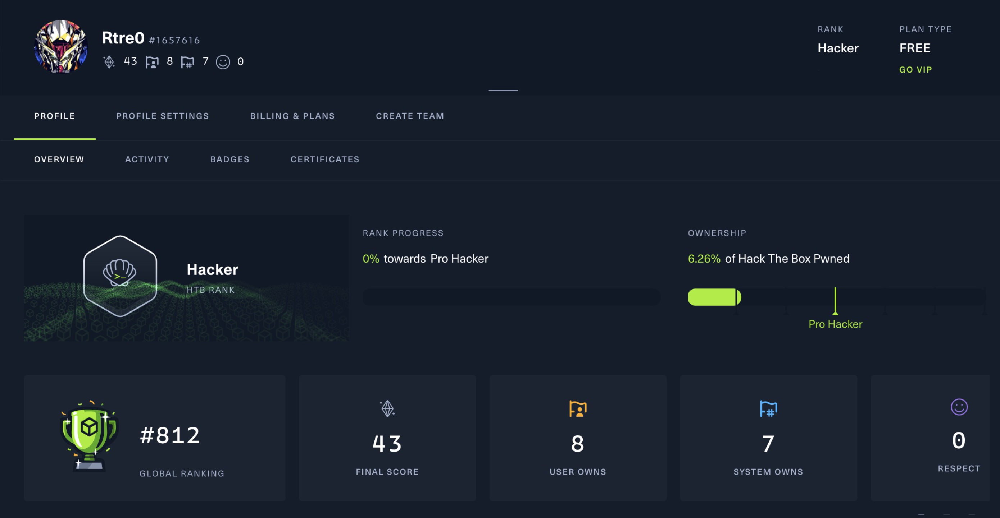

<p>


```python
>>> import Rtre0
"Hi, I'm Rtre0! AKA script kiddie!"
>>> s1mple.name
('s1mple', 'Rtre0')
>>> s1mple.interests
[ 'Cyberpunk 2077', 'WatchDog2']
>>> s1mple.learning
['network security',  'Distributed Systems','Big Data','Route Switch']
>>> s1mple.dev_devices
["kali liunx", "Macbook pro m1"]
```

📊 **Weekly development breakdown**
<!--START_SECTION:waka-->

```txt
Python       11 hrs 20 mins  ██████████████▓░░░░░░░░░░   58.75 %
TeX          5 hrs 50 mins   ███████▓░░░░░░░░░░░░░░░░░   30.28 %
CSV          1 hr 46 mins    ██▒░░░░░░░░░░░░░░░░░░░░░░   09.16 %
Markdown     7 mins          ▒░░░░░░░░░░░░░░░░░░░░░░░░   00.68 %
C++          6 mins          ░░░░░░░░░░░░░░░░░░░░░░░░░   00.59 %
```

<!--END_SECTION:waka-->
</p>
<div align="center">


<h2 align="left">🏆 Favourite Tools</h2>
<div>
    
    
</div>


<h2 align="left">🏆 My Honor</h2>
<div>
    
    
</div>

